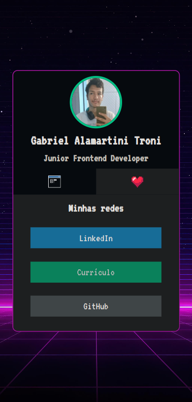
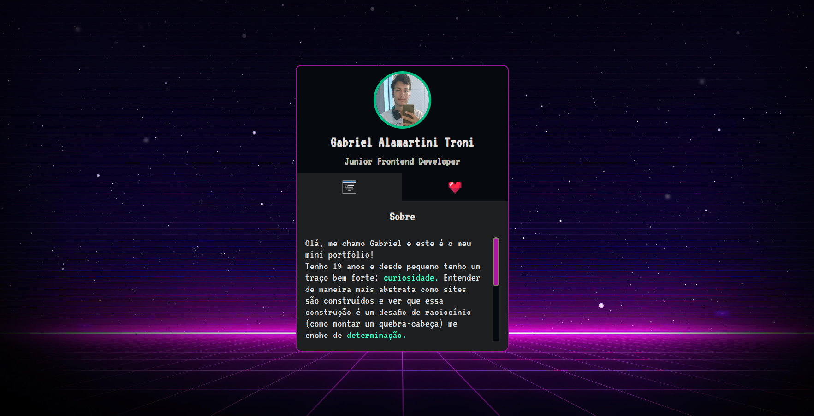

# Mini Portfolio
A web page containing information about me and my contacts. Please note that, as an old project, the information there may not be up-to-date. If you are looking for my current information, feel free to visit the "About" section on GitHub.

## Technologies Used
- Figma
- Javascript
- CSS
- HTML

## Features
- Navigation using anchor tags
- Toggle dark/light mode
- Ensure responsiveness for different screen sizes

## Screenshots

  
  

## Acknowledgements
A special thanks to Ricardo and Roberto Dias from "Dev em Dobro" for hosting the one-week course for this project.
